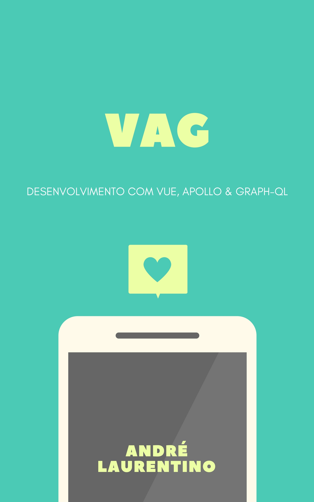

# VAG
Material em PT-BR sobre VAG 

  
Esse material é para aqueles que querem aprender  um pouco sobre uma das combinações do momento VAG. O VAG é formado por Vue, ApolloJS e GraphQL. Essas tecnologias possibilitam desenvolver aplicações incríveis. Este material é apenas uma base para você entender como é trabalhar com essas três tecnologias. Caso queira ver mais detalhes recomendo que acesse a documentação de cada tecnologia.   
